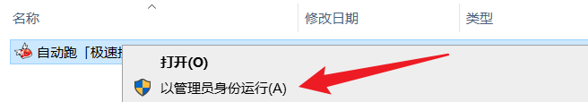
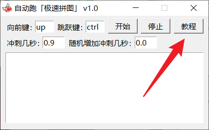
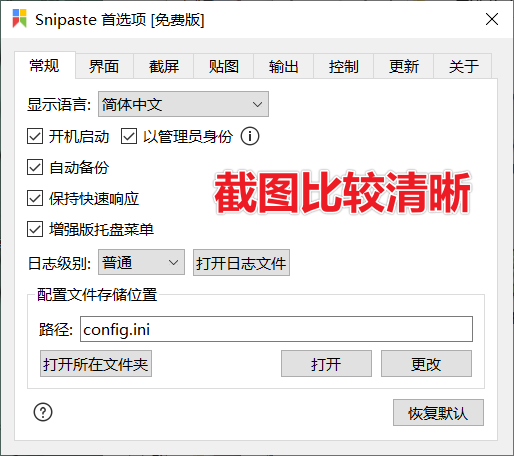
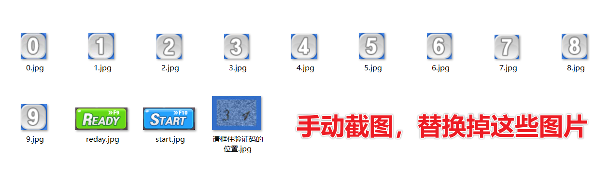
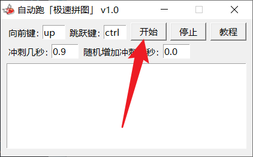
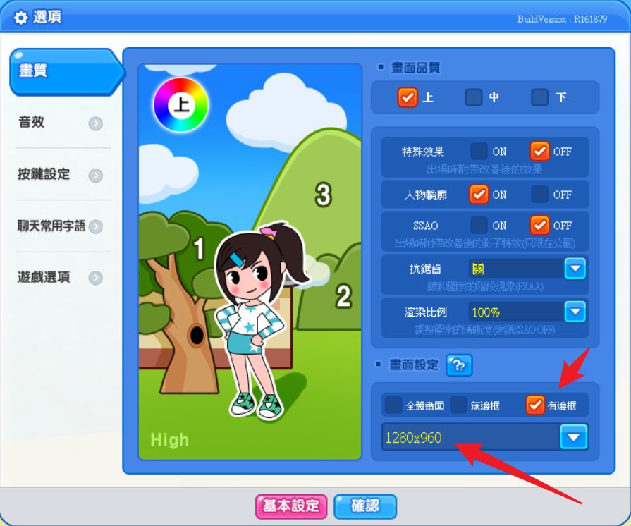

# 游戏启动流程

## 确保管理员运行

### 进入教程

### 打开目录

### 推荐截图软件

**[snipaste官网下载](https://zh.snipaste.com)**

### 替换截图

## 启动程序

# 解决无法点击按钮的情况

## 调整「游戏分辨率」「窗口化」

- **「分辨率」和「跑图按钮」清晰度有关系**
- **我的素材是「低分辨率」，所以「默认图片可能点击失败」**
- **确保游戏窗口是「窗口化」而不是「无边框」**

## 重新替换截图

